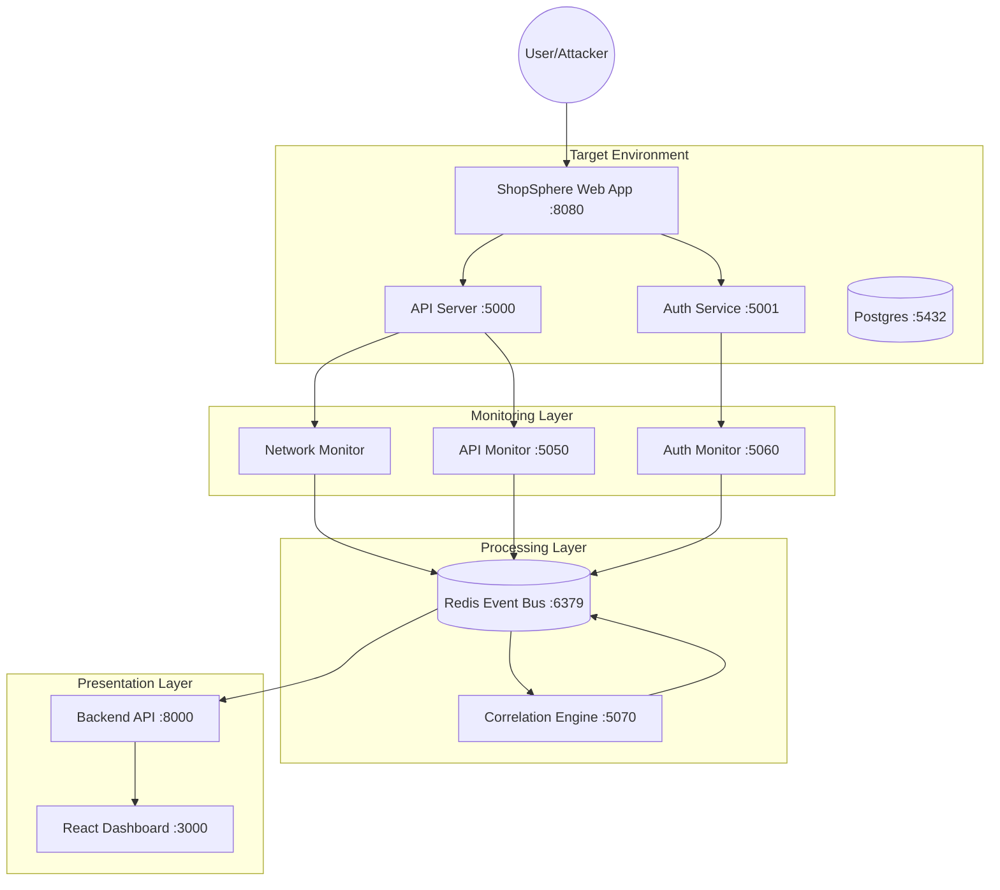

# 🛡️ SecuriSphere

**Multi-Layer Cybersecurity Monitoring and Threat Correlation Framework for Containerized Environments**

---

## Table of Contents
- [Overview](#overview)
- [Architecture](#architecture)
- [Features](#features)
- [Quick Start](#quick-start)
- [System Components](#system-components)
- [ShopSphere — Live Demo Web App](#-shopsphere--live-demo-web-app)
- [Correlation Rules](#correlation-rules)
- [Risk Scoring](#risk-scoring)
- [Attack Simulator](#attack-simulator)
- [Evaluation](#evaluation)
- [Dashboard](#dashboard)
- [API Reference](#api-reference)
- [Configuration](#configuration)
- [Troubleshooting](#troubleshooting)
- [Contributing](#contributing)
- [License](#license)

---

## Overview

SecuriSphere is a comprehensive, open-source cybersecurity framework designed to monitor, detect, and correlate threats across multiple layers of a modern microservices application. By integrating Network, API, and Authentication monitoring into a unified correlation engine, SecuriSphere detects complex "low-and-slow" attacks that often bypass single-layer defenses. It provides real-time visibility through a React-based dashboard and includes a built-in attack simulator for validating defenses against real-world scenarios like SQL Injection, Brute Force, and Privilege Escalation.

Designed for DevSecOps teams and security researchers, SecuriSphere demonstrates how to implement correlation logic, risk scoring, and automated incident response in containerized environments.

---

## Architecture



### Data Flow
1. **Attack Occurs**: Malicious traffic hits the Target services.
2. **Detection**: Monitors capture logs/traffic, apply immediate detection rules (e.g., regex for SQLi), and publish normalized events to Redis.
3. **Correlation**: The Engine consumes events, updates risk scores, and checks for multi-event patterns (Rules).
4. **Response**: If a rule triggers, an Incident is created and published.
5. **Visualization**: The Backend pushes updates via WebSocket to the Dashboard for real-time alerts.

---

## Features

- **Real-time Multi-Layer Monitoring**: Simultaneous visibility into Network traffic, API requests, and Authentication events.
- **Unified Event Schema**: All events are normalized to a standard JSON format inspired by OCSF.
- **Advanced Correlation Engine**: 7 built-in rules detect complex kill chains, not just isolated alerts.
- **Dynamic Risk Scoring**: Entity-based risk scoring with cross-layer bonuses and time-based decay.
- **Automated Attack Simulator**: On-demand generation of 5 attack scenarios (including Stealth and Full Kill Chain).
- **Interactive Dashboard**: React-based UI with live event feeds, risk heatmaps, and incident metrics.
- **ShopSphere Victim Web App**: A realistic e-commerce frontend for live SQL Injection and Brute Force demonstrations.
- **Quantitative Evaluation**: Built-in framework to measure Detection Rate, False Positive Rate, and MTTD.
- **Docker-First Design**: Entire stack deploys with a single command.

---

## Quick Start

### Prerequisites
- Docker Desktop (v20.10+)
- Docker Compose (v2.0+)
- 4GB+ RAM available
- Ports 3000, 5000-5001, 5050-5070, 6379, 8000, 8080 available.

### Installation & Run

1. **Clone the Repository**
   ```bash
   git clone https://github.com/yourusername/securisphere.git
   cd securisphere
   ```

2. **Start the System**
   ```bash
   make setup    # First time only (database init)
   make start    # Starts all containers
   ```

3. **Verify Deployment**
   ```bash
   make health   # Checks status of all services
   ```

4. **Access the Applications**
   - ShopSphere (Victim Store): [http://localhost:8080](http://localhost:8080)
   - Security Dashboard: [http://localhost:3000](http://localhost:3000)

5. **Run a Demo Attack**
   ```bash
   make run-demo  # Interactive menu to launch attacks
   ```

---

## System Components

| Service | Port | Description |
|---------|------|-------------|
| **securisphere-webapp** | 8080 | ShopSphere Victim E-commerce (Nginx) |
| **securisphere-dashboard** | 3000 | Security Dashboard UI (React + Tailwind) |
| **securisphere-api** | 5000 | Vulnerable Target API (Flask) |
| **securisphere-auth** | 5001 | Target Auth Service (Flask) |
| **securisphere-apimon** | 5050 | Detects SQLi, XSS, Path Traversal |
| **securisphere-authmon** | 5060 | Detects Brute Force, Cred Stuffing |
| **securisphere-correlator** | 5070 | Core Logic: Rules + Risk Scoring |
| **securisphere-backend** | 8000 | Aggregates data for Dashboard |
| **securisphere-redis** | 6379 | Event Bus & State Store |
| **securisphere-db** | 5432 | User & Product Database |

---

## 🛒 ShopSphere — Live Demo Web App

ShopSphere is a purpose-built "victim" e-commerce website that serves as the attack surface during live security demonstrations. It runs on **port 8080** and proxies requests to the backend API and Auth services through Nginx.

### Demo Flow

1. **Open ShopSphere**: Navigate to [http://localhost:8080](http://localhost:8080) — products load from the API server.
2. **SQL Injection Demo**: In the search bar, type `' OR '1'='1` and press Search. The query is forwarded to the vulnerable API, and the Security Dashboard ([http://localhost:3000](http://localhost:3000)) detects it in real-time.
3. **Brute Force Demo**: Click **Login** (or go to [http://localhost:8080/login.html](http://localhost:8080/login.html)). Enter username `admin` and try passwords like `pass1`, `pass2`, `pass3`, etc. The Dashboard detects the repeated failed login attempts.

### Architecture

```
Browser ──► :8080 (Nginx)
               ├── /           → Static HTML (index.html, login.html)
               ├── /api/*      → Reverse Proxy → api-server:5000
               └── /auth/*     → Reverse Proxy → auth-service:5001
```

### Files

| File | Purpose |
|------|--------|
| `targets/web-app/Dockerfile` | Nginx Alpine container for static serving + reverse proxy |
| `targets/web-app/nginx.conf` | Server block with proxy rules for `/api/` and `/auth/` |
| `targets/web-app/html/index.html` | E-commerce homepage with product grid and search bar |
| `targets/web-app/html/login.html` | Login page with brute force attempt counter and shake animation |

---

## Correlation Rules

The engine currently implements 7 heuristic rules:

1. **Reconnaissance followed by Exploitation**: Port scan (Network) followed by SQLi/XSS (API).
2. **Credential Compromise**: Brute force attempts followed by a successful login.
3. **Full Kill Chain**: Detects activity across all 3 layers (Net -> Auth -> API) targeting the same asset.
4. **Automated Attack Tooling**: High-frequency API errors combined with Auth failures.
5. **Distributed Credential Attack**: Multiple source IPs targeting the same user account.
6. **Data Exfiltration**: Successful exploit followed by accessing sensitive endpoints/bulk export.
7. **Persistent Threat / Stealth**: 
   - *Standard*: High event volume (>10) in short window.
   - *Stealth Mode*: Detects isolated Critical events (e.g., single SQLi) that attempt to evade frequency filters.

---

## Risk Scoring

Risk is tracked per Source Entity (IP Address).

- **Base Scores**:
  - Low Severity Event: +10
  - Medium Severity Event: +25
  - High Severity Event: +50
  - Critical Severity Event: +100

- **Multipliers**:
  - **Cross-Layer Bonus**: Events detected on multiple layers trigger a 1.5x multiplier.

- **Decay**:
  - Scores decay by 5 points every minute to allow "cooling off" of benign anomalies.

- **Thresholds**:
  - **Normal**: 0 - 30
  - **Suspicious**: 31 - 70
  - **Threatening**: 71 - 150
  - **Critical**: >150 (Triggers immediate blocking recommendation)

---

## Attack Simulator

SecuriSphere includes a Python-based attack simulator (`simulation/`) that acts as a Red Team agent.

**Available Scenarios:**
1. **Full Kill Chain**: Port Scan -> Brute Force -> Admin Login -> SQL Injection -> Data Exfiltration.
2. **API Abuse**: High-volume Fuzzing, XSS attempts, and Broken Object Level Authorization (BOLA) checks.
3. **Credential Stuffing**: Distributed brute force attack from multiple spoofed IPs.
4. **Stealth Attack**: "Low and Slow" execution of a single critical exploit to test detection sensitivity.
5. **Benign Traffic**: Generates normal user behavior (browsing, searching, logging in) to test False Positive rates.

Usage:
```bash
make attack-killchain
make attack-stealth
make attack-benign
```

---

## 📦 PCAP File Analysis

SecuriSphere can analyze pre-captured network traffic from .pcap files, providing a clear INPUT → OUTPUT demonstration.

### Generate Sample .pcap Files
```bash
make generate-pcap
# Creates: samples/pcap/port_scan_sample.pcap
# Creates: samples/pcap/dns_tunneling_sample.pcap
# Creates: samples/pcap/mixed_attack_sample.pcap
```

### Analyze .pcap Files
Analyze a file and push events to the Dashboard:
```bash
make analyze-pcap FILE=samples/pcap/mixed_attack_sample.pcap
```

### Interactive Demo
Launch the PCAP demo menu to generate samples and run analysis interactively:
```bash
make pcap-demo
```

> **Note for Windows Users**:
> If `make` is not installed, use the included `run.bat` script:
> - `.\run.bat generate-pcap`
> - `.\run.bat analyze-pcap samples/pcap/mixed_attack_sample.pcap`
> - `.\run.bat pcap-info samples/pcap/mixed_attack_sample.pcap`

### Dashboard Integration
1. Open dashboard: http://localhost:3000
2. Click "📦 PCAP Analysis" tab
3. Upload a .pcap file OR select a sample
4. View results: packet stats, charts, detected events
5. Events automatically appear in Events tab
6. Correlation Engine processes events automatically

---

## Evaluation

The framework includes a self-evaluation suite that runs all scenarios and calculates performance metrics.

**Metrics:**
- **Detection Rate (DR)**: % of attacks correctly identified.
- **False Positive Rate (FPR)**: % of benign actions incorrectly flagged.
- **Alert Reduction Ratio**: Ratio of Raw Events to Correlated Incidents (Efficiency).
- **Mean Time To Detect (MTTD)**: Time from first attack event to Incident creation.

Run Evaluation:
```bash
make evaluate
```

---

## Dashboard

The React Dashboard provides:
- **Live Event Feed**: Real-time stream of raw security events.
- **Incident Timeline**: Correlated alerts with drill-down details.
- **Risk Heatmap**: Visual representation of active threats by IP.
- **System Health**: Status of all containers and Redis connectivity.
- **Stats Overview**: Total events, active incidents, and reduction metrics.

---

## Configuration

Environment variables in `.env` control system behavior:

- `REDIS_HOST`, `REDIS_PORT`: Redis connection details.
- `POSTGRES_USER`, `POSTGRES_PASSWORD`: Database credentials.
- `LOG_LEVEL`: Logging verbosity (INFO/DEBUG).
- `SIMULATION_DELAY`: Speed of attack simulation.

---

## Troubleshooting

See [TROUBLESHOOTING.md](TROUBLESHOOTING.md) for detailed solutions to common problems like:
- Redis connection failures
- Docker volume permission issues
- Port conflicts
- WebSocket disconnection

---

## Contributing

We welcome contributions! Please see [CONTRIBUTING.md](CONTRIBUTING.md) for guidelines on code style, testing, and pull requests.

---

## License

MIT License. See [LICENSE](LICENSE) file for details.
